# Instant Clone for Multi-Team Development

## Overview

This tutorial demonstrates how **MatrixOne's Copy-on-Write cloning** enables efficient multi-team collaboration on large production datasets. Learn how teams can work independently without storage bloat or time-consuming data copies.

**Real-World Scenario: Multiple Teams Need Production Data**

Your organization has large production databases, and multiple teams need isolated environments for testing:

- 📊 **Data Science**: Train ML models on production data
- 🧪 **QA Team**: Run destructive integration tests
- 👨‍💻 **Dev Team**: Experiment with schema changes
- ⏰ **Time-Travel**: Test against historical snapshots

**The Challenge:**

- 🐢 **Slow**: Traditional copy takes 30-60 minutes for 1TB
- 💸 **Expensive**: Each copy doubles storage (1TB → 2TB → 3TB...)
- 🔒 **Risky**: Teams can't work independently without conflicts
- 📦 **Wasteful**: Identical data stored multiple times

**MatrixOne's Solution:**

- ⚡ **Instant**: Clone 1TB database in **< 5 seconds**
- 💰 **Efficient**: 1TB stays 1TB, not 4TB (Copy-on-Write)
- 🔓 **Isolated**: Each team gets independent environment
- 🗑️ **Safe**: Delete clones without affecting source

## Why This Matters for Teams

**Traditional Approach Problems:**

```
Production DB (1TB) → Full Copy → Storage Explosion

Team 1: Copy 1TB (30 min) → 2TB total storage
Team 2: Copy 1TB (30 min) → 3TB total storage
Team 3: Copy 1TB (30 min) → 4TB total storage

Result: 4TB storage, 90 minutes, $$$$ costs
```

**MatrixOne Approach:**

```
Production DB (1TB) → Instant Clone → Minimal Storage

Team 1: Clone (5 sec) → 1TB storage (copy-on-write)
Team 2: Clone (5 sec) → 1TB storage (copy-on-write)
Team 3: Clone (5 sec) → 1TB storage (copy-on-write)

Result: ~1.02TB storage, 15 seconds, 💰 75% savings!
```

**Comparison Table:**

| Aspect | Traditional Copy | MatrixOne Clone |
|--------|-----------------|-----------------|
| **1TB Clone Time** | 30-60 minutes | **< 5 seconds** ⚡ |
| **3 Team Copies Storage** | 4TB (1 + 1 + 1 + 1) | **~1.02TB** (base + deltas) 💰 |
| **Team Isolation** | Separate databases | Independent Copy-on-Write |
| **Delete Clone** | Drop database | Drop without affecting source |
| **CI/CD Friendly** | Too slow | Perfect for automation |
| **Cost for Cloud** | 4x storage cost | ~1x storage cost |

## Key Benefits

### For Development Teams 👨‍💻

- ✅ **Experiment Freely**: Test schema changes without risk
- ✅ **Parallel Development**: Multiple branches, multiple clones
- ✅ **Fast Iteration**: Create → Test → Delete in seconds
- ✅ **No Conflicts**: Each developer gets isolated environment

### For QA Teams 🧪

- ✅ **Destructive Testing**: Run tests that modify/delete data
- ✅ **Parallel Testing**: Multiple test suites, multiple clones
- ✅ **Fresh State**: New clone for each test run
- ✅ **Production Parity**: Test on real production data

### For Data Science Teams 📊

- ✅ **Large Datasets**: Clone TB-scale data instantly
- ✅ **Experiment Tracking**: One clone per experiment
- ✅ **Model Training**: Full production data for ML
- ✅ **No Interference**: Train models without affecting prod

### For CI/CD Pipelines 🔄

- ✅ **Fast Provisioning**: Spin up test DB in seconds
- ✅ **Cost Effective**: No storage explosion
- ✅ **Automated Testing**: Clone → Test → Delete
- ✅ **Scalable**: Handle hundreds of parallel jobs

## Multi-Team Workflow Diagram

```mermaid
graph TD
    Production["🏢 Production Database<br>1TB - User Behavior Logs<br>Millions of rows"]

    Snapshot["📸 Optional: Snapshot<br>Point-in-time backup<br>< 1 second"]

    DSClone["📊 Data Science Clone<br>⚡ 5 seconds<br>💰 +10MB storage"]
    QAClone["🧪 QA Clone<br>⚡ 5 seconds<br>💰 +5MB storage"]
    DevClone["👨‍💻 Dev Clone<br>⚡ 5 seconds<br>💰 +8MB storage"]
    TTClone["⏰ Time-Travel Clone<br>From snapshot<br>💰 +0MB storage"]

    DSWork["ML Model Training<br>Modify 100 rows<br>Add predictions"]
    QAWork["Integration Tests<br>Delete test data<br>Run destructive tests"]
    DevWork["Schema Changes<br>Add indexes<br>Insert test data"]
    TTWork["Historical Testing<br>Yesterday's data<br>Regression tests"]

    DSDelete["🗑️ Delete DS Clone<br>Production unaffected"]
    QADelete["🗑️ Delete QA Clone<br>Other clones unaffected"]
    DevDelete["🗑️ Delete Dev Clone<br>Work independently"]

    Production --> Snapshot
    Production --> DSClone
    Production --> QAClone
    Production --> DevClone
    Snapshot --> TTClone

    DSClone --> DSWork
    QAClone --> QAWork
    DevClone --> DevWork
    TTClone --> TTWork

    DSWork --> DSDelete
    QAWork --> QADelete
    DevWork --> DevDelete

    style Production fill:#d4edda,stroke:#28a745,stroke-width:3px
    style Snapshot fill:#fff3cd
    style DSClone fill:#d1ecf1
    style QAClone fill:#d1ecf1
    style DevClone fill:#d1ecf1
    style TTClone fill:#d1ecf1
    style DSWork fill:#e2e3e5
    style QAWork fill:#e2e3e5
    style DevWork fill:#e2e3e5
    style TTWork fill:#e2e3e5
```



### Workflow Explanation

| Step | Action | Time | Storage | Team Isolation |
|------|--------|------|---------|----------------|
| 1️⃣ **Production** | Large database running | - | 1TB | Source data |
| 2️⃣ **Clone DS** | Data Science team | 5s | +0MB | Independent |
| 3️⃣ **Clone QA** | QA team | 5s | +0MB | Independent |
| 4️⃣ **Clone Dev** | Dev team | 5s | +0MB | Independent |
| 5️⃣ **Modify** | Each team works | - | +deltas | Isolated |
| 6️⃣ **Delete** | Clean up clones | 1s | Freed | No impact |

**Key Points:**

- 🟢 **Green**: Production database (untouched)
- 🔵 **Blue**: Team clones (instant, isolated)
- ⚪ **Gray**: Independent modifications
- All clones can be deleted without affecting production or each other!

!!! success "Copy-on-Write Magic"
    **How It Works:**

    When you clone a database:

    1. ✅ **No data copying**: Only metadata created (< 5 seconds)
    2. ✅ **Shared storage**: All clones read from same underlying data
    3. ✅ **Write isolation**: Modified data stored separately (Copy-on-Write)
    4. ✅ **Independent lifecycle**: Delete clones without affecting source

    **Example:**
    ```
    Production: 1TB
    + DS Clone: 0MB (shared read)
    + QA Clone: 0MB (shared read)
    + Dev Clone: 0MB (shared read)

    After work:
    + DS modifies 100 rows → +10MB
    + QA deletes 500 rows → +5MB
    + Dev adds 200 rows → +8MB

    Total storage: 1.023TB (not 4TB!)
    Savings: 75% storage cost 💰
    ```

!!! note "MatrixOne Python SDK Documentation"
    For complete API reference, see [MatrixOne Python SDK Documentation](https://matrixone.readthedocs.io/en/latest/)

## Before You Start

### Prerequisites

- MatrixOne database installed and running
- Python 3.7 or higher
- MatrixOne Python SDK installed

```bash
pip3 install matrixone-python-sdk
```

### Import Required Libraries

```python
from matrixone import Client, SnapshotLevel
from matrixone.config import get_connection_params
from matrixone.orm import declarative_base
from matrixone.sqlalchemy_ext import create_vector_column
from sqlalchemy import BigInteger, Column, String, Integer, Float, Text
from datetime import datetime
import time
import numpy as np
```

## Complete Working Example

### Phase 1: Setup Production Database

#### Connect to Database

```python
from matrixone import Client
from matrixone.config import get_connection_params

# Connect to MatrixOne
host, port, user, password, database = get_connection_params()
client = Client()
client.connect(host=host, port=port, user=user, password=password, database=database)

print(f"Connected to {host}:{port}/{database}")
```

#### Create Production Database with Large Table

```python
from matrixone.orm import declarative_base
from matrixone.sqlalchemy_ext import create_vector_column
from sqlalchemy import BigInteger, Column, String, Integer, Float

Base = declarative_base()

# Define large production table
class UserBehavior(Base):
    """Large production table: user behavior logs"""
    __tablename__ = "user_behavior"

    id = Column(BigInteger, primary_key=True, autoincrement=True)
    user_id = Column(BigInteger)
    product_id = Column(BigInteger)
    action = Column(String(50))  # view, click, purchase
    timestamp = Column(BigInteger)
    session_id = Column(String(100))
    device_type = Column(String(50))
    price = Column(Float)
    quantity = Column(Integer)
    embedding = create_vector_column(128, "f32")  # Behavior embedding

# Create production database
prod_db = "production_data"
client.execute(f"CREATE DATABASE IF NOT EXISTS {prod_db}")

# Connect to production
prod_client = Client()
prod_client.connect(host=host, port=port, user=user, password=password, database=prod_db)

# Create table
prod_client.create_table(UserBehavior)
print(f"Created production table: {UserBehavior.__tablename__}")
```

#### Insert Large Dataset

```python
import numpy as np

# Simulate large production dataset (1000 rows = millions in production)
actions = ["view", "click", "add_to_cart", "purchase", "review"]
devices = ["mobile", "desktop", "tablet"]

batch_data = []
for i in range(1000):
    batch_data.append({
        "user_id": (i % 100) + 1,
        "product_id": (i % 50) + 1,
        "action": actions[i % len(actions)],
        "timestamp": int(time.time() * 1000) + i,
        "session_id": f"session_{i // 10}",
        "device_type": devices[i % len(devices)],
        "price": round(10 + (i % 500) * 1.5, 2),
        "quantity": (i % 5) + 1,
        "embedding": np.random.rand(128).astype(np.float32).tolist()
    })

prod_client.batch_insert(UserBehavior, batch_data)

total_records = prod_client.query(UserBehavior).count()
print(f"Production ready: {total_records:,} records (~100MB, represents 10GB+ in production)")

prod_client.disconnect()
```

### Phase 2: Data Science Team - Clone for ML Training

#### Instant Clone for Data Science

```python
# ⚡ INSTANT CLONE: 1TB database cloned in < 5 seconds
# 💰 ZERO STORAGE OVERHEAD: 1TB stays 1TB (Copy-on-Write)

ds_db = "datasci_experiment_ml"
clone_start = time.time()

# Clone production database - instant operation!
client.clone.clone_database(
    target_db=ds_db,
    source_db=prod_db
)

clone_time = time.time() - clone_start
print(f"Data Science clone completed in {clone_time:.2f} seconds")
print(f"No data copied - metadata operation only")
print(f"Storage: ~0 MB additional (Copy-on-Write)")
```

#### Data Science Work: ML Model Training

```python
# Connect to DS database
ds_client = Client()
ds_client.connect(host=host, port=port, user=user, password=password, database=ds_db)

# Verify clone has same data
ds_count = ds_client.query(UserBehavior).count()
print(f"DS clone verified: {ds_count:,} records")

# Add ML model predictions (triggers Copy-on-Write)
for i in range(100):
    ds_client.query(UserBehavior).filter(
        UserBehavior.id == i + 1
    ).update(price=999.99)  # Mark as processed by ML model

print(f"Updated 100 records with ML predictions")
print(f"Only modified rows are stored (Copy-on-Write)")
print(f"Production data: completely unaffected")

ds_client.disconnect()
```

### Phase 3: QA Team - Clone for Integration Testing

#### Instant Clone for QA

```python
qa_db = "qa_integration_test"

# ⚡ Another instant clone - still no storage overhead!
client.clone.clone_database(
    target_db=qa_db,
    source_db=prod_db
)

print(f"QA clone created: {qa_db}")
print(f"QA can run destructive tests safely")
```

#### QA Work: Destructive Testing

```python
# Connect to QA database
qa_client = Client()
qa_client.connect(host=host, port=port, user=user, password=password, database=qa_db)

# Run destructive tests - delete data
qa_client.query(UserBehavior).filter(
    UserBehavior.action == "purchase"
).delete().execute()

qa_count = qa_client.query(UserBehavior).count()
print(f"QA deleted purchase records for testing")
print(f"QA database now: {qa_count:,} records")
print(f"Production: unaffected")
print(f"DS clone: unaffected")

qa_client.disconnect()
```

### Phase 4: Dev Team - Clone for Schema Experimentation

#### Instant Clone for Development

```python
dev_db = "dev_schema_experiment"

# ⚡ Third instant clone - still efficient!
client.clone.clone_database(
    target_db=dev_db,
    source_db=prod_db
)

print(f"Dev clone created: {dev_db}")
```

#### Dev Work: Schema Changes and Testing

```python
# Connect to Dev database
dev_client = Client()
dev_client.connect(host=host, port=port, user=user, password=password, database=dev_db)

# Experiment with vector index
dev_client.vector_ops.create_ivf(
    UserBehavior,
    "idx_embedding_test",
    "embedding",
    lists=10,
    op_type="vector_l2_ops"
)

print(f"Created IVF index on embedding column")
print(f"Testing vector search performance")

# Insert test data
test_records = []
for i in range(50):
    test_records.append({
        "user_id": 999,  # Test user
        "product_id": 999,
        "action": "test_action",
        "timestamp": int(time.time() * 1000),
        "session_id": f"test_session_{i}",
        "device_type": "test_device",
        "price": 0.01,
        "quantity": 1,
        "embedding": np.random.rand(128).astype(np.float32).tolist()
    })

dev_client.batch_insert(UserBehavior, test_records)

dev_count = dev_client.query(UserBehavior).count()
print(f"Dev inserted {len(test_records)} test records")
print(f"Dev database: {dev_count:,} records")

dev_client.disconnect()
```

### Phase 5: Verify Production Integrity

```python
# Reconnect to production
prod_client = Client()
prod_client.connect(host=host, port=port, user=user, password=password, database=prod_db)

prod_count = prod_client.query(UserBehavior).count()
test_users = prod_client.query(UserBehavior).filter(UserBehavior.user_id == 999).count()

print(f"\n Production Database Integrity Check:")
print(f"Original records: {total_records:,}")
print(f"Current records: {prod_count:,}")
print(f"Data integrity: {'PRESERVED' if prod_count == total_records else 'MODIFIED'}")
print(f"Test records: {test_users} (expected: 0)")
print(f"\n All team clones are completely isolated!")

prod_client.disconnect()
```

### Phase 6: Storage Efficiency Analysis

```python
print("\n"+"="* 70)
print("Storage Efficiency Comparison")
print("="* 70)

print("\n Traditional Copy Approach:")
print(f"Production: 10 GB")
print(f"DS Clone: 10 GB (full copy)")
print(f"QA Clone: 10 GB (full copy)")
print(f"Dev Clone: 10 GB (full copy)")
print(f"─────────────────────")
print(f"Total: 40 GB")
print(f"Time: ~90 minutes (30 min × 3)")

print("\n MatrixOne Clone (Copy-on-Write):")
print(f"Production: 10 GB")
print(f"DS Clone: ~0 GB + 10 MB (modified data)")
print(f"QA Clone: ~0 GB + 5 MB (modified data)")
print(f"Dev Clone: ~0 GB + 8 MB (modified data)")
print(f"─────────────────────")
print(f"Total: ~10.023 GB")
print(f"Time: ~15 seconds (5 sec × 3)")

print("\n Savings:")
print(f"Storage: 75% saved (29.977 GB)")
print(f"Time: 99.7% faster (89.75 min saved)")
print(f"Cloud cost: ~75% reduction")
print(f"Team productivity: Unlimited!")
```

### Phase 7: Independent Clone Deletion

```python
# Delete QA clone - production and other clones unaffected
client.execute(f"DROP DATABASE {qa_db}")
print(f"\n Dropped QA database: {qa_db}")

# Verify production still intact
prod_client = Client()
prod_client.connect(host=host, port=port, user=user, password=password, database=prod_db)
prod_count_final = prod_client.query(UserBehavior).count()

print(f"Production after QA clone deletion:")
print(f"Records: {prod_count_final:,} (unchanged)")
print(f"Other clones (DS, Dev): still accessible")

prod_client.disconnect()
```

### Phase 8: Time-Travel Testing with Snapshots

```python
# Create snapshot of current state
snapshot_name = f"prod_snapshot_{datetime.now().strftime('%Y%m%d_%H%M%S')}"
client.snapshots.create(
    name=snapshot_name,
    level=SnapshotLevel.DATABASE,
    database=prod_db
)

print(f"\n Created snapshot: {snapshot_name}")

# Simulate production getting new data (today's data)
prod_client = Client()
prod_client.connect(host=host, port=port, user=user, password=password, database=prod_db)

new_data = []
for i in range(100):
    new_data.append({
        "user_id": 200 + i,
        "product_id": 1,
        "action": "new_purchase",
        "timestamp": int(time.time() * 1000),
        "session_id": f"new_session_{i}",
        "device_type": "mobile",
        "price": 99.99,
        "quantity": 1,
        "embedding": np.random.rand(128).astype(np.float32).tolist()
    })

prod_client.batch_insert(UserBehavior, new_data)
new_total = prod_client.query(UserBehavior).count()
print(f"Production received 100 new records")
print(f"Production now: {new_total:,} records")

prod_client.disconnect()

# Clone from snapshot (yesterday's data)
timetravel_db = "test_yesterday_data"
client.clone.clone_database_with_snapshot(
    target_db=timetravel_db,
    source_db=prod_db,
    snapshot_name=snapshot_name
)

# Verify historical data
tt_client = Client()
tt_client.connect(host=host, port=port, user=user, password=password, database=timetravel_db)
tt_count = tt_client.query(UserBehavior).count()

print(f"\n Time-travel clone created:")
print(f"Production (today): {new_total:,} records")
print(f"Clone (snapshot): {tt_count:,} records")
print(f"Testing against historical data!")

tt_client.disconnect()
```

## Clone Operations Reference

### Basic Clone Operations

#### Clone Current Database

```python
# Clone current state of database
client.clone.clone_database(
    target_db="new_database_name",
    source_db="source_database"
)
```

**Use Cases:**

- Quick test environment
- Parallel development branches
- Data Science experiments
- QA testing

#### Clone from Snapshot

```python
# Clone historical state from snapshot
client.clone.clone_database_with_snapshot(
    target_db="historical_clone",
    source_db="production",
    snapshot_name="prod_snapshot_20250110"
)
```

**Use Cases:**

- Time-travel testing
- Compare before/after states
- Regression testing
- Historical analysis

### Snapshot Operations

#### Create Snapshot

```python
client.snapshots.create(
    name="my_snapshot",
    level=SnapshotLevel.DATABASE,
    database="production"
)
```

#### List Snapshots

```python
snapshots = client.snapshots.list()
for snap in snapshots:
    print(f"Snapshot: {snap.name}, Created: {snap.created_at}")
```

#### Delete Snapshot

```python
client.snapshots.delete("my_snapshot")
```

## Best Practices

### 1. Use Clones for Every Test Run

!!! tip "Fresh Start Every Time"
    ```python
    def run_test_suite():
        """Create fresh clone for each test run"""
        test_db = f"test_run_{datetime.now().strftime('%Y%m%d_%H%M%S')}"

        # Clone production
        client.clone.clone_database(
            target_db=test_db,
            source_db="production"
        )

        # Run tests
        try:
            run_tests_on(test_db)
        finally:
            # Clean up
            client.execute(f"DROP DATABASE {test_db}")
    ```

### 2. Leverage Copy-on-Write for CI/CD

!!! tip "Parallel CI Jobs"
    ```python
    # Each CI job gets its own clone - no storage penalty!

    # Job 1: Unit tests
    client.clone.clone_database(target_db="ci_job_1", source_db="prod")

    # Job 2: Integration tests
    client.clone.clone_database(target_db="ci_job_2", source_db="prod")

    # Job 3: Performance tests
    client.clone.clone_database(target_db="ci_job_3", source_db="prod")

    # Total time: ~15 seconds for all 3
    # Total storage: ~production size (not 3x!)
    ```

### 3. Use Snapshots for Time-Travel

!!! tip "Historical Testing"
    ```python
    # Daily snapshot
    client.snapshots.create(
        name=f"daily_{datetime.now().strftime('%Y%m%d')}",
        level=SnapshotLevel.DATABASE,
        database="production"
    )

    # Clone from last week's snapshot for regression test
    client.clone.clone_database_with_snapshot(
        target_db="regression_test",
        source_db="production",
        snapshot_name="daily_20250103"
    )
    ```

### 4. Clean Up Clones Regularly

!!! tip "Automated Cleanup"
    ```python
    def cleanup_old_clones(prefix="test_", days_old=7):
        """Drop clones older than N days"""
        cutoff = datetime.now() - timedelta(days=days_old)

        # List all databases
        databases = client.execute("SHOW DATABASES")

        for db in databases:
            if db['name'].startswith(prefix):
                # Check creation time and drop if old
                # (implementation depends on metadata tracking)
                pass
    ```

### 5. Name Clones Descriptively

```python
def generate_clone_name(team, purpose):
    """Generate descriptive clone name"""
    timestamp = datetime.now().strftime('%Y%m%d_%H%M%S')
    return f"{team}_{purpose}_{timestamp}"

# Examples
ds_clone = generate_clone_name("datasci", "ml_training")
# → "datasci_ml_training_20250110_143052"

qa_clone = generate_clone_name("qa", "integration_test")
# → "qa_integration_test_20250110_143052"
```

## Performance Characteristics

### Clone Operations

**Real-World Performance:**

| Database Size | Clone Time | Storage After Clone | Storage After Modifications |
|--------------|------------|---------------------|---------------------------|
| 100GB | < 3 seconds | 100GB (no change) | 100GB + deltas |
| 1TB | < 5 seconds | **1TB (no change)** | 1TB + deltas |
| 10TB | < 10 seconds | 10TB (no change) | 10TB + deltas |

**Multi-Team Scenario:**

```
Production: 1TB
+ 10 team clones created: ~10 seconds total
+ Storage after cloning: 1TB (unchanged!)

After 1 week of work:
+ Each team modifies ~1% of data: +10GB per clone
+ Total storage: 1TB + (10 × 10GB) = 1.1TB
+ Traditional approach: 1TB × 11 = 11TB

Savings: 90% storage cost! 💰
```

### Snapshot Operations

**Create Snapshot:**

- ⚡ < 2 seconds for any size database
- 📦 Metadata operation only
- 💾 No storage overhead initially

**Clone from Snapshot:**

- ⚡ Same as regular clone (< 5 seconds)
- 📅 Access historical data instantly
- 💾 Copy-on-Write applies

## Use Cases and Examples

### Use Case 1: Data Science Experimentation

```python
# Each data scientist gets their own clone
for scientist in ["alice", "bob", "charlie"]:
    clone_db = f"datasci_{scientist}_experiment"
    client.clone.clone_database(
        target_db=clone_db,
        source_db="production"
    )
    print(f"Created clone for {scientist}")

# Result: 3 full production copies in 15 seconds
# Storage: ~production size (not 3x!)
```

### Use Case 2: Blue-Green Deployment Testing

```python
# Current production (blue)
blue_db = "production_v1"

# Create green environment for v2 testing
green_db = "production_v2_candidate"
client.clone.clone_database(
    target_db=green_db,
    source_db=blue_db
)

# Test v2 changes on green
test_results = run_v2_tests(green_db)

if test_results.success:
    # Promote green to production
    client.execute(f"RENAME DATABASE {green_db} TO {blue_db}")
else:
    # Discard green, keep blue
    client.execute(f"DROP DATABASE {green_db}")
```

### Use Case 3: Parallel A/B Testing

```python
# Create multiple variants for A/B testing
variants = ["control", "variant_a", "variant_b", "variant_c"]

for variant in variants:
    clone_db = f"ab_test_{variant}"
    client.clone.clone_database(
        target_db=clone_db,
        source_db="production"
    )

    # Apply variant-specific changes
    apply_variant_changes(clone_db, variant)

    # Run tests
    metrics = collect_metrics(clone_db)

print(f"4 parallel A/B tests completed")
print(f"Time: ~20 seconds")
print(f"Storage: ~production size")
```

### Use Case 4: CI/CD Pipeline Integration

```python
# .github/workflows/ci.yml equivalent in Python

def ci_pipeline(branch_name):
    """CI pipeline with isolated database"""

    # 1. Create test database for this branch
    test_db = f"ci_{branch_name}_{int(time.time())}"

    client.clone.clone_database(
        target_db=test_db,
        source_db="production_snapshot"
    )

    # 2. Run migrations
    apply_migrations(test_db)

    # 3. Run tests
    test_results = run_test_suite(test_db)

    # 4. Clean up
    client.execute(f"DROP DATABASE {test_db}")

    return test_results

# Each PR gets isolated test environment
# No conflicts between parallel CI jobs
# No storage explosion
```

## Troubleshooting

### Issue: Clone Takes Longer Than Expected

**Symptoms:** Clone operation takes > 10 seconds

**Possible Causes:**

- Network latency
- Database has many small files
- First clone after MatrixOne restart

**Solution:**

```python
# Subsequent clones should be faster
# First clone may take longer to warm up metadata
```

### Issue: Cannot Drop Clone Database

**Symptoms:** Error when trying to drop cloned database

**Possible Causes:**

- Active connections to clone
- Clone being used by another process

**Solution:**

```python
# Disconnect all clients first
client.disconnect()

# Then drop database
client.execute(f"DROP DATABASE {clone_db}")
```

### Issue: Storage Growing Faster Than Expected

**Symptoms:** Storage usage higher than expected with Copy-on-Write

**Possible Causes:**

- Many modifications to cloned data
- Large bulk inserts/updates

**Explanation:**

```python
# Copy-on-Write stores deltas
# If you modify 50% of cloned data, storage grows by 50%
# This is still better than traditional copy (100% overhead)

# Example:
# Production: 1TB
# Clone + modify 50%: 1TB + 0.5TB = 1.5TB
# Traditional copy: 1TB + 1TB = 2TB
# Still 25% savings!
```

**Solution:**

- Drop clones you no longer need
- Use snapshots for read-only historical access
- Consider storage budget when planning modifications

## Summary

**MatrixOne's Copy-on-Write cloning enables:**

✅ **Instant Cloning**

- 1TB database cloned in < 5 seconds
- No waiting for data copy
- Perfect for rapid iteration

✅ **Storage Efficiency**

- 10 clones ≈ 1x storage (not 10x!)
- Copy-on-Write stores only changes
- 75-90% storage savings

✅ **Team Productivity**

- Each team gets isolated environment
- No conflicts between teams
- Parallel testing and development

✅ **Cost Reduction**

- Massive cloud storage savings
- Reduced infrastructure costs
- Better resource utilization

✅ **CI/CD Friendly**

- Fast test database provisioning
- Parallel job execution
- Automated workflows

**Key Operations:**

```python
# Clone current database
client.clone.clone_database(target_db="new_db", source_db="source_db")

# Clone from snapshot
client.clone.clone_database_with_snapshot(
    target_db="historical_clone",
    source_db="production",
    snapshot_name="my_snapshot"
)

# Create snapshot
client.snapshots.create(name="backup", level=SnapshotLevel.DATABASE, database="prod")

# Drop clone (no impact on source)
client.execute("DROP DATABASE clone_db")
```

**Perfect For:**

- 👨‍💻 Multi-team development
- 🧪 CI/CD pipelines
- 📊 Data Science experiments
- 🔬 Schema migrations
- 🧪 Integration testing
- ⏰ Time-travel debugging

Start leveraging MatrixOne's efficient cloning today and transform your team's workflow! 🚀
