# Safe Production Upgrade with Instant Rollback Demo

## Overview

This tutorial demonstrates how to **safely upgrade production systems with zero-risk rollback** using MatrixOne's snapshot capabilities. Learn battle-tested strategies for protecting critical databases during major changes.

**Real-World Scenario: E-commerce System Upgrade Gone Wrong**

Your production e-commerce system needs an upgrade, but things don't go as planned:

- 🚀 **Upgrade Attempt**: v1.0 → v2.0 (add categories, ratings, reviews)
- ⚠️ **Failure Detected**: Data integrity issues after deployment
- ⚡ **Instant Recovery**: Rollback to v1.0 in seconds using snapshot
- 🛡️ **Zero Data Loss**: Pre-upgrade snapshot preserves exact state
- ✅ **Production Safe**: Minimize downtime, restore confidence

**Why MatrixOne Snapshots Are Game-Changing:**

- ⚡ **Blazing Fast**: 1TB database? Snapshot in **seconds**, not hours
- 💰 **Zero Storage Overhead**: 1TB clone = still 1TB, not 2TB! (copy-on-write)
- 🚀 **Instant Restore**: Rollback entire database with one API call
- 📦 **No Data Movement**: Metadata operation only, no data copying
- 💵 **Cost Effective**: No doubled storage costs for clones/snapshots

**Traditional vs MatrixOne:**

| Operation | Traditional Backup | MatrixOne Snapshot |
|-----------|-------------------|-------------------|
| 1TB Clone Time | 30-60 minutes | **< 5 seconds** |
| Storage Cost | 1TB → 2TB (doubled) | 1TB → 1TB (no change) |
| Rollback Time | Hours | **Seconds** |
| Data Movement | Full copy | Metadata only |

## Upgrade and Rollback Workflow Diagram


### Workflow Steps Explained

| Phase | Action | Result | Time |
|-------|--------|--------|------|
| 1️⃣ **Initial State** | Deploy v1.0 system | 5 products, 4 columns | - |
| 2️⃣ **Create Snapshot** | `snapshots.create()` | Backup created | ⚡ < 1s |
| 3️⃣ **Upgrade** | Schema + data migration | 7 products, 8 columns | ~10s |
| 4️⃣ **Validate** | Run integrity checks | ✗ Failed | ~5s |
| 5️⃣ **Verify Snapshot** | Clone to test DB | Verified OK | ⚡ < 1s |
| 6️⃣ **Restore** | `restore.restore_database()` | Back to v1.0 | ⚡ < 1s |

## Schema Evolution Diagram

Visual comparison of v1.0 and v2.0 schemas:

```mermaid
graph TD
    V1_Header["v1.0 Schema - Simple Product Catalog"]
    V1_Table["products table"]
    V1_Col1["id: BigInteger PK"]
    V1_Col2["name: String 200"]
    V1_Col3["price: Integer"]
    V1_Col4["stock: Integer"]
    V1_Info["Total: 4 columns<br>Data: 5 products"]

    V1_Header --> V1_Table
    V1_Table --> V1_Col1
    V1_Table --> V1_Col2
    V1_Table --> V1_Col3
    V1_Table --> V1_Col4
    V1_Table --> V1_Info

    Arrow1["⬇️ UPGRADE<br>Schema Migration<br>Data Migration"]
    V1_Info --> Arrow1

    V2_Header["v2.0 Schema - Enhanced Product System"]
    V2_Table["products table"]
    V2_Col1["id: BigInteger PK"]
    V2_Col2["name: String 200"]
    V2_Col3["category: String 100 NEW"]
    V2_Col4["description: Text NEW"]
    V2_Col5["price: Integer"]
    V2_Col6["stock: Integer"]
    V2_Col7["rating: Float NEW"]
    V2_Col8["review_count: Integer NEW"]
    V2_Info["Total: 8 columns +4 new<br>Data: 7 products +2 new"]

    Arrow1 --> V2_Header
    V2_Header --> V2_Table
    V2_Table --> V2_Col1
    V2_Table --> V2_Col2
    V2_Table --> V2_Col3
    V2_Table --> V2_Col4
    V2_Table --> V2_Col5
    V2_Table --> V2_Col6
    V2_Table --> V2_Col7
    V2_Table --> V2_Col8
    V2_Table --> V2_Info

    Arrow2["⬆️ ROLLBACK<br>Restore from Snapshot<br>Instant Operation"]
    V2_Info -.-> Arrow2
    Arrow2 -.-> V1_Info

    style V1_Header fill:#d4edda,stroke:#28a745,stroke-width:3px
    style V1_Table fill:#c3e6cb
    style V1_Info fill:#d4edda

    style V2_Header fill:#fff3cd,stroke:#ffc107,stroke-width:3px
    style V2_Table fill:#ffeeba
    style V2_Col3 fill:#d1ecf1
    style V2_Col4 fill:#d1ecf1
    style V2_Col7 fill:#d1ecf1
    style V2_Col8 fill:#d1ecf1
    style V2_Info fill:#fff3cd

    style Arrow1 fill:#fff,stroke:#28a745,stroke-width:2px
    style Arrow2 fill:#fff,stroke:#dc3545,stroke-width:2px,stroke-dasharray: 5 5
```



### Schema Comparison Summary

| Aspect | v1.0 (Before) | v2.0 (After) | Change |
|--------|---------------|--------------|---------|
| **Columns** | 4 | 8 | +4 new fields |
| **Products** | 5 | 7 | +2 new products |
| **Features** | Basic catalog | Categories, ratings, reviews | Enhanced |
| **New Fields** | - | category, description, rating, review_count | Added |
| **Migration** | - | Default values for existing data | Required |

**Key Points:**

- **Green boxes**: v1.0 stable state
- **Yellow boxes**: v2.0 enhanced state
- **Blue boxes**: New columns in v2.0
- **Solid arrow ⬇️**: Upgrade direction (forward)
- **Dashed arrow ⬆️**: Rollback direction (using snapshot)

**Key Features:**

- ⚡ **Instant Snapshots**: Create backup in seconds (even for TB-scale databases)
- 🔄 **Fast Restore**: Rollback entire database quickly
- ✅ **Data Integrity**: Preserve exact state including schema
- 🛡️ **Zero Data Loss**: Complete backup of code and data
- 🔍 **Verification**: Clone snapshot to test before restore
- 💰 **Zero Storage Overhead**: Copy-on-write technology (no data duplication)

!!! success "MatrixOne's Copy-on-Write Technology"
    **How It Works:**

    When you create a snapshot or clone:

    - ✅ **No data copying**: Only metadata is created (< 1 second)
    - ✅ **No storage doubling**: 1TB database → snapshot still uses 1TB
    - ✅ **Instant operation**: TB-scale clones complete in seconds
    - ✅ **Efficient writes**: Only new changes consume additional storage

    **Example:**
    ```
    Original DB: 1TB data
    Create Snapshot: 1TB (same storage, instant)
    Clone Database: 1TB (still same storage!)

    After modifications:
    - Write 10GB to clone → Total storage: 1.01TB (not 2TB!)
    - Only deltas are stored
    ```

    **Production Benefits:**

    - 🏢 Create unlimited test environments from production snapshots
    - 💵 No 2x storage cost penalty
    - ⚡ Instant database provisioning for QA/staging
    - 🔄 Fast disaster recovery without storage bloat

!!! note "MatrixOne Python SDK Documentation"
    For complete API reference, see [MatrixOne Python SDK Documentation](https://matrixone.readthedocs.io/en/latest/)

## Before You Start

### Prerequisites

- MatrixOne database installed and running
- Python 3.7 or higher
- MatrixOne Python SDK installed
- Appropriate permissions for snapshot operations

### Install SDK

```bash
pip3 install matrixone-python-sdk
```

## Complete Working Example

Save this as `snapshot_rollback_demo.py` and run with `python3 snapshot_rollback_demo.py`:

```python
from matrixone import Client, SnapshotLevel
from matrixone.config import get_connection_params
from matrixone.orm import declarative_base
from sqlalchemy import BigInteger, Column, String, Integer, Float, Text
from datetime import datetime
import time

print("="* 80)
print("Database Snapshot Demo: System Upgrade and Rollback")
print("="* 80)

# Connect
host, port, user, password, database = get_connection_params(database='demo')
client = Client()
client.connect(host=host, port=port, user=user, password=password, database=database)

Base = declarative_base()

# v1.0 Schema
class ProductV1(Base):
    __tablename__ = "products"
    id = Column(BigInteger, primary_key=True, autoincrement=True)
    name = Column(String(200))
    price = Column(Integer)
    stock = Column(Integer)

# Create v1.0 system
client.drop_table(ProductV1)
client.create_table(ProductV1)

# Insert v1.0 data
v1_products = [
    {"name": "Gaming Laptop", "price": 1500, "stock": 20},
    {"name": "Wireless Mouse", "price": 30, "stock": 150},
    # ... more products
]
for product in v1_products:
    client.insert(ProductV1, product)

v1_count = client.query(ProductV1).count()
print(f"v1.0 System: {v1_count} products")

# Create snapshot before upgrade
snapshot_name = f"pre_upgrade_v1_{datetime.now().strftime('%Y%m%d_%H%M%S')}"
client.snapshots.create(
    name=snapshot_name,
    level=SnapshotLevel.DATABASE,
    database=database
)
print(f"Snapshot created: {snapshot_name}")

# Upgrade to v2.0 (with problems)
# ... schema changes, data migration ...
print("Upgrade problem detected!")

# Clone for verification
# ⚡ INSTANT: Even 1TB database clones in seconds!
# 💰 COST: No storage overhead - 1TB stays 1TB (copy-on-write)
verify_db = f"{database}_verify"
client.clone.clone_database_with_snapshot(
    target_db=verify_db,
    source_db=database,
    snapshot_name=snapshot_name
)
print(f"Cloned snapshot to {verify_db} for verification")
print(f"- Clone completed in seconds (even for TB-scale databases)")
print(f"- No storage duplication - still using same storage!")

# Restore database
client.restore.restore_database(
    snapshot_name=snapshot_name,
    account_name='sys',
    database_name=database
)
print(f"Database restored to v1.0!")

# Cleanup
client.snapshots.delete(snapshot_name)
client.disconnect()
print("Demo completed!")
```

## Upgrade and Rollback Workflow

### Phase 1: Pre-Upgrade (v1.0 System)

#### Deploy v1.0 Schema

```python
class ProductV1(Base):
    """v1.0: Simple product table"""
    __tablename__ = "products"

    id = Column(BigInteger, primary_key=True, autoincrement=True)
    name = Column(String(200))
    price = Column(Integer)
    stock = Column(Integer)

client.create_table(ProductV1)
```

#### Insert v1.0 Data

```python
v1_products = [
    {"name": "Gaming Laptop", "price": 1500, "stock": 20},
    {"name": "Wireless Mouse", "price": 30, "stock": 150},
    {"name": "Mechanical Keyboard", "price": 120, "stock": 80},
    {"name": "4K Monitor", "price": 400, "stock": 45},
    {"name": "USB-C Hub", "price": 50, "stock": 200},
]

for product in v1_products:
    client.insert(ProductV1, product)

print(f"v1.0 System deployed with {len(v1_products)} products")
```

### Phase 2: Create Snapshot

#### Create Database-Level Snapshot

```python
from matrixone import SnapshotLevel
from datetime import datetime

# Generate unique snapshot name with timestamp
snapshot_name = f"pre_upgrade_v1_{datetime.now().strftime('%Y%m%d_%H%M%S')}"

# Create snapshot
client.snapshots.create(
    name=snapshot_name,
    level=SnapshotLevel.DATABASE,
    database=database
)

print(f"Snapshot created: {snapshot_name}")
```

**Snapshot Levels:**

- `SnapshotLevel.ACCOUNT` - Entire account
- `SnapshotLevel.DATABASE` - Single database (recommended for upgrades)
- `SnapshotLevel.TABLE` - Single table

#### Verify Snapshot

```python
# Get snapshot info
snapshot_info = client.snapshots.get(snapshot_name)

print(f"Snapshot details:")
print(f"- Name: {snapshot_info.name}")
print(f"- Created: {snapshot_info.created_at}")
print(f"- Level: {snapshot_info.level}")
print(f"- Database: {snapshot_info.database}")
```

### Phase 3: Perform Upgrade

#### Upgrade to v2.0 Schema

```python
# Backup v1 data
v1_data = client.query(ProductV1).all()

# Drop old table
client.drop_table(ProductV1)

# Create v2.0 schema
class ProductV2(Base):
    """v2.0: Enhanced product table"""
    __tablename__ = "products"

    id = Column(BigInteger, primary_key=True, autoincrement=True)
    name = Column(String(200))
    category = Column(String(100))      # NEW
    description = Column(Text)          # NEW
    price = Column(Integer)
    stock = Column(Integer)
    rating = Column(Float)              # NEW
    review_count = Column(Integer)      # NEW

client.create_table(ProductV2)
print("Upgraded to v2.0 schema")
```

#### Migrate Data

```python
# Migrate v1 data to v2 schema with defaults
for old_product in v1_data:
    v2_product = {
        "id": old_product.id,
        "name": old_product.name,
        "category": "Electronics",  # Default value
        "description": f"Description for {old_product.name}",
        "price": old_product.price,
        "stock": old_product.stock,
        "rating": 4.5,  # Default
        "review_count": 0  # Default
    }
    client.insert(ProductV2, v2_product)

print(f"Migrated {len(v1_data)} products to v2.0")
```

### Phase 4: Problem Detection

#### Validation Checks

```python
# Check 1: Data integrity
integrity_ok = verify_data_integrity()

# Check 2: Application compatibility
app_ok = test_application_endpoints()

# Check 3: Performance benchmarks
perf_ok = run_performance_tests()

if not (integrity_ok and app_ok and perf_ok):
    print("CRITICAL: Upgrade validation failed!")
    print("Decision: ROLLBACK to v1.0 using snapshot")
```

### Phase 5: Verify Snapshot (Before Rollback)

#### Clone Database for Verification

```python
verify_db = f"{database}_verify"

# Clone database from snapshot
# ⚡ Performance: Instant clone even for TB-scale databases
# 💰 Storage: No doubling - uses copy-on-write (1TB → 1TB, not 2TB)
client.clone.clone_database_with_snapshot(
    target_db=verify_db,
    source_db=database,
    snapshot_name=snapshot_name
)

print(f"Created verification database: {verify_db}")
print(f"- Clone completed in < 5 seconds (metadata operation)")
print(f"- Storage: No additional cost until you modify data")
```

#### Test Cloned Database

```python
# Connect to verification database
verify_client = Client()
verify_client.connect(
    host=host, port=port, user=user,
    password=password, database=verify_db
)

# Verify data
verify_count = verify_client.query(ProductV1).count()
print(f"Products in snapshot: {verify_count}")

# Verify specific records
laptop = verify_client.query(ProductV1).filter(
    ProductV1.name == "Gaming Laptop"
).first()

if laptop and laptop.price == 1500:
    print("Snapshot verification passed!")
else:
    print("✗ Snapshot verification failed!")

verify_client.disconnect()
```

### Phase 6: Restore Database (Rollback)

#### Direct Database Restore

```python
# Restore database to snapshot state
success = client.restore.restore_database(
    snapshot_name=snapshot_name,
    account_name='sys',
    database_name=database
)

if success:
    print(f"Database restored successfully!")
    print(f"- {database} rolled back to v1.0")

    # Verify restore
    restored_count = client.query(ProductV1).count()
    print(f"- Product count: {restored_count}")
else:
    print("✗ Restore failed")
```

**Important:** Restore is instantaneous! The database immediately returns to the snapshot state.

## Snapshot Operations

### Create Snapshot

#### Database-Level Snapshot

```python
client.snapshots.create(
    name="my_snapshot",
    level=SnapshotLevel.DATABASE,
    database="mydb"
)
```

#### Table-Level Snapshot

```python
client.snapshots.create(
    name="my_table_snapshot",
    level=SnapshotLevel.TABLE,
    database="mydb",
    table="products"
)
```

#### Account-Level Snapshot

```python
client.snapshots.create(
    name="full_backup",
    level=SnapshotLevel.ACCOUNT
)
```

### List Snapshots

```python
# Get all snapshots
all_snapshots = client.snapshots.list()

for snap in all_snapshots:
    print(f"{snap.name}: {snap.created_at}")
```

### Get Snapshot Info

```python
snapshot_info = client.snapshots.get("snapshot_name")

print(f"Name: {snapshot_info.name}")
print(f"Created: {snapshot_info.created_at}")
print(f"Level: {snapshot_info.level}")
print(f"Database: {snapshot_info.database}")
```

### Delete Snapshot

```python
client.snapshots.delete("snapshot_name")
print("Snapshot deleted")
```

## Restore Operations

### Direct Database Restore

Replace entire database with snapshot:

```python
client.restore.restore_database(
    snapshot_name="my_snapshot",
    account_name='sys',
    database_name="mydb"
)
```

**Warning:** This replaces the entire database!

### Clone for Safe Restore

Create a copy first, then swap:

```python
# Step 1: Clone to new database
client.clone.clone_database_with_snapshot(
    target_db="mydb_restored",
    source_db="mydb",
    snapshot_name="my_snapshot"
)

# Step 2: Verify cloned database
# ... run tests ...

# Step 3: If OK, rename databases (in SQL)
client.execute("DROP DATABASE mydb")
client.execute("ALTER DATABASE mydb_restored RENAME TO mydb")
```

## Use Cases

### 1. Production Deployments

```python
def safe_production_upgrade():
    # Before upgrade
    snapshot = create_pre_deployment_snapshot()

    # Perform upgrade
    try:
        upgrade_database()
        upgrade_application()

        # Validate
        if not validate_upgrade():
            raise Exception("Validation failed")

        # Success - keep snapshot for 7 days
        print("Upgrade successful")

    except Exception as e:
        # Rollback
        print(f"✗ Upgrade failed: {e}")
        restore_from_snapshot(snapshot)
        print("Rolled back to previous version")
```

### 2. Schema Migrations

```python
# Before migration
snapshot = client.snapshots.create(
    name="pre_migration",
    level=SnapshotLevel.DATABASE,
    database=database
)

# Run migration scripts
try:
    run_alembic_migrations()
    validate_schema()
except Exception as e:
    # Rollback on failure
    client.restore.restore_database(
        snapshot_name="pre_migration",
        database_name=database
    )
```

### 3. Data Import Validation

```python
# Before bulk import
snapshot = create_snapshot("pre_import")

# Import data
import_csv_data("large_file.csv")

# Validate
if not validate_import():
    # Rollback
    restore_from_snapshot(snapshot)
    print("Import failed, rolled back")
else:
    # Keep snapshot for 24 hours
    schedule_snapshot_cleanup(snapshot, hours=24)
```

### 4. Testing and Development

```python
# Create snapshot of production data
prod_snapshot = client.snapshots.create(
    name="prod_backup",
    level=SnapshotLevel.DATABASE,
    database="production"
)

# Clone to test environment
client.clone.clone_database_with_snapshot(
    target_db="test_env",
    source_db="production",
    snapshot_name="prod_backup"
)

# Run tests on cloned database
# Original production database untouched
```

## Best Practices

### 0. Leverage Zero-Cost Cloning 🆕

!!! tip "Use Copy-on-Write to Your Advantage"
    **MatrixOne's secret weapon: Unlimited free clones!**

    Since clones use copy-on-write (no storage overhead), you can:

    ```python
    # Create multiple test environments at NO COST
    production_snapshot = "prod_20250110"

    # QA environment - instant, free
    client.clone.clone_database_with_snapshot(
        target_db="qa_env",
        source_db="production",
        snapshot_name=production_snapshot
    )  # ⚡ 5 seconds, 💰 0 storage cost

    # Staging environment - instant, free
    client.clone.clone_database_with_snapshot(
        target_db="staging_env",
        source_db="production",
        snapshot_name=production_snapshot
    )  # ⚡ 5 seconds, 💰 0 storage cost

    # Developer environment - instant, free
    client.clone.clone_database_with_snapshot(
        target_db="dev_env",
        source_db="production",
        snapshot_name=production_snapshot
    )  # ⚡ 5 seconds, 💰 0 storage cost

    # Result: 3 full copies of production (1TB each)
    # Traditional cost: 4TB storage (1 prod + 3 copies)
    # MatrixOne cost: 1TB storage! (copy-on-write magic)
    # Savings: 75% storage cost! 💰💰💰
    ```

    **Production Use Cases:**
    - ✅ Create unlimited test environments from prod snapshots
    - ✅ Give each developer their own full production dataset
    - ✅ Run parallel A/B tests on separate clones
    - ✅ Test dangerous migrations risk-free
    - ✅ All at near-zero storage cost!

### 1. Snapshot Naming Convention

```python
def generate_snapshot_name(purpose, version=None):
    """Generate descriptive snapshot name"""
    timestamp = datetime.now().strftime('%Y%m%d_%H%M%S')

    if version:
        return f"{purpose}_v{version}_{timestamp}"
    else:
        return f"{purpose}_{timestamp}"

# Examples
snapshot_name = generate_snapshot_name("pre_upgrade", "2.0")
# → "pre_upgrade_v2.0_20250110_143052"

snapshot_name = generate_snapshot_name("daily_backup")
# → "daily_backup_20250110_143052"
```

### 2. Always Verify Before Restore

```python
def safe_restore(client, snapshot_name, database_name):
    """Safely restore with verification"""

    # Step 1: Clone for verification
    verify_db = f"{database_name}_verify"
    client.clone.clone_database_with_snapshot(
        target_db=verify_db,
        source_db=database_name,
        snapshot_name=snapshot_name
    )

    # Step 2: Verify cloned database
    verify_client = Client()
    verify_client.connect(database=verify_db)

    is_valid = verify_database(verify_client)
    verify_client.disconnect()

    # Step 3: Restore only if verification passed
    if is_valid:
        client.restore.restore_database(
            snapshot_name=snapshot_name,
            database_name=database_name
        )
        print("Restore successful")
    else:
        print("✗ Verification failed, restore aborted")

    # Step 4: Cleanup verification database
    client.execute(f"DROP DATABASE {verify_db}")
```

### 3. Snapshot Retention Policy

```python
def cleanup_old_snapshots(client, retention_days=7):
    """Delete snapshots older than retention period"""

    from datetime import datetime, timedelta

    all_snapshots = client.snapshots.list()
    cutoff_date = datetime.now() - timedelta(days=retention_days)

    for snapshot in all_snapshots:
        if snapshot.created_at < cutoff_date:
            client.snapshots.delete(snapshot.name)
            print(f"Deleted old snapshot: {snapshot.name}")
```

### 4. Document Snapshot Purpose

```python
# Keep metadata in application database or external system
snapshot_metadata = {
    "name": snapshot_name,
    "purpose": "Pre-upgrade to v2.0",
    "created_by": "deploy_script",
    "created_at": datetime.now(),
    "version_before": "1.0",
    "version_target": "2.0",
    "can_delete_after": datetime.now() + timedelta(days=30)
}

# Store in metadata table or external system
save_snapshot_metadata(snapshot_metadata)
```

### 5. Upgrade Checklist

```python
def production_upgrade_checklist():
    """Pre-upgrade checklist"""

    checklist = {
        "snapshot_created": False,
        "snapshot_verified": False,
        "rollback_plan": False,
        "stakeholders_notified": False,
        "maintenance_window": False
    }

    # 1. Create snapshot
    snapshot = client.snapshots.create(...)
    checklist["snapshot_created"] = True

    # 2. Verify snapshot
    if verify_snapshot(snapshot):
        checklist["snapshot_verified"] = True

    # 3. Prepare rollback procedure
    document_rollback_steps()
    checklist["rollback_plan"] = True

    # 4. Notify stakeholders
    send_notifications()
    checklist["stakeholders_notified"] = True

    # 5. Confirm maintenance window
    checklist["maintenance_window"] = is_in_maintenance_window()

    # Check all items
    if all(checklist.values()):
        print("All pre-upgrade checks passed")
        return True
    else:
        print("✗ Pre-upgrade checks failed")
        print(f"Failed: {[k for k, v in checklist.items() if not v]}")
        return False
```

## Troubleshooting

### Issue: "Snapshot creation failed"

**Cause:** Insufficient permissions or disk space

**Solution:** Check permissions and available space

```python
try:
    client.snapshots.create(name="my_snapshot", level=SnapshotLevel.DATABASE)
except Exception as e:
    print(f"Snapshot failed: {e}")
    # Check permissions, disk space, etc.
```

### Issue: "Restore didn't work as expected"

**Cause:** Wrong database or snapshot name

**Solution:** Verify names before restore

```python
# List snapshots
snapshots = client.snapshots.list()
for s in snapshots:
    print(f"{s.name} -> {s.database}")

# Verify exact names
snapshot_info = client.snapshots.get(snapshot_name)
print(f"Will restore: {snapshot_info.database}")
```

### Issue: "Cloned database has wrong data"

**Cause:** Wrong snapshot specified

**Solution:** Verify snapshot before cloning

```python
# Get snapshot details first
snap = client.snapshots.get(snapshot_name)
print(f"Snapshot database: {snap.database}")
print(f"Created: {snap.created_at}")

# Then clone
client.clone.clone_database_with_snapshot(...)
```

## Performance Characteristics

### Snapshot Operations

**Create Snapshot:**

- ⚡ Nearly instant (metadata operation)
- 📦 No data copy - uses storage layer snapshots
- 💾 Minimal storage overhead (copy-on-write)

**Real-World Performance:**

| Database Size | Snapshot Time | Clone Time | Storage Used |
|--------------|---------------|------------|--------------|
| 100GB | < 1 second | < 3 seconds | 100GB (no change) |
| 1TB | < 2 seconds | < 5 seconds | **1TB (not 2TB!)** |
| 10TB | < 5 seconds | < 10 seconds | 10TB (no change) |

**Cost Comparison:**

```
Traditional Approach:
- 1TB production DB
- Create backup: 1TB copy → Storage: 2TB (doubled cost 💸)
- Time: 30-60 minutes

MatrixOne Approach:
- 1TB production DB
- Create snapshot: metadata only → Storage: 1TB (no change 💰)
- Time: < 5 seconds

Savings: 50% storage cost + 99% faster! 🎯
```

**Restore Database:**

- ⚡ Instant operation
- 🔄 Atomic - either succeeds completely or fails
- 📊 No data copying - pointer updates only

**Clone from Snapshot:**

- ⚡ Fast operation
- 📦 Creates independent database copy
- 🔒 Original snapshot unchanged

### Recommended Snapshot Schedule

```python
# Daily snapshots
schedule.every().day.at("02:00").do(create_daily_snapshot)

# Pre-deployment snapshots
before_deployment(create_snapshot)

# Before major data operations
before_bulk_import(create_snapshot)
before_bulk_delete(create_snapshot)
```

## Production Deployment Pattern

### Blue-Green Deployment with Snapshots

```python
def blue_green_deployment(client, database_name, new_version):
    """Deploy new version using blue-green pattern"""

    # Current database is "blue" (production)
    blue_db = database_name
    green_db = f"{database_name}_green"

    # Step 1: Create snapshot of blue
    snapshot = client.snapshots.create(
        name=f"blue_backup_{new_version}",
        level=SnapshotLevel.DATABASE,
        database=blue_db
    )

    # Step 2: Clone blue to green
    client.clone.clone_database_with_snapshot(
        target_db=green_db,
        source_db=blue_db,
        snapshot_name=snapshot.name
    )

    # Step 3: Upgrade green database
    upgrade_database(green_db, new_version)

    # Step 4: Test green database
    if validate_upgrade(green_db):
        # Step 5: Switch traffic to green
        switch_application_to_database(green_db)
        print(f"Switched to {green_db}")

        # Keep blue for quick rollback if needed
    else:
        # Upgrade failed, cleanup green
        client.execute(f"DROP DATABASE {green_db}")
        print("Rollback completed, still on blue")
```

## Reference

- [MatrixOne Python SDK Documentation](https://matrixone.readthedocs.io/en/latest/)
- [Snapshot and Restore Guide](../Maintain/backup-restore/mobr-snapshot-backup-restore.md)
- [CREATE SNAPSHOT](../Reference/SQL-Reference/Data-Definition-Language/create-snapshot.md)
- [RESTORE SNAPSHOT](../Reference/SQL-Reference/Data-Definition-Language/restore-snapshot.md)

## Summary

Database snapshots in MatrixOne enable safe production operations:

✅ **Instant Snapshots**: Create backup in seconds, not hours
✅ **Fast Rollback**: Restore entire database instantly
✅ **Zero Data Loss**: Exact point-in-time recovery
✅ **Schema + Data**: Both code and data preserved
✅ **Verify Before Restore**: Clone to test snapshot validity
✅ **Efficient Storage**: Copy-on-write, minimal overhead

**Golden Rule:** Always create a snapshot before major changes! 🛡️

**Workflow:**

1. 📸 Create snapshot
2. 🔍 Verify snapshot (clone + test)
3. 🚀 Perform upgrade/change
4. ✅ Validate results
5. 🔄 Restore if problems detected (instant rollback!)

Perfect for production deployments, schema migrations, and any high-risk database operations! 🚀
